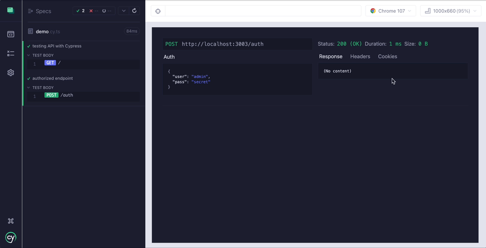
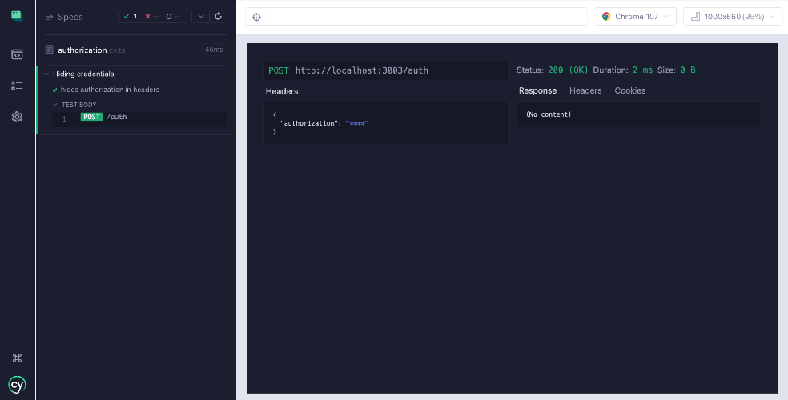

<h2 align=center>Cypress plugin API</h2>
<p align="center">
<a href="https://github.com/sponsors/filiphric"></a>
<a href="https://dashboard.cypress.io/projects/v2x96h/runs"></a>
</p>

<p align="center">
Cypress plugin for effective API testing. Imagine Postman, but in Cypress. Prints out information about the API call in the Cypress App UI.
</p>



### Features
- cy.api() command, that will information about the API call, such as URL, headers, response and more to the UI frame
- all of the info can be viewed in a time-travel snapshots
- simple table for viewing cookies
- color coding of methods in UI view and in timeline
- calculating size of the response
- [combine API calls with UI](#snapshot-only-mode)
- [hide sensitive headers and auth information](#hiding-credentials)
- [`requestMode` to add cy.api() features to cy.request() command](#requestmode---enable-ui-for-cyrequest-command)
- [TypeScript support](#typescript-support)

### Installation

Install this package:
```bash
npm i cypress-plugin-api
# or
yarn add cypress-plugin-api
```

Import the plugin into your `cypress/support/e2e.js` file:
```js
import 'cypress-plugin-api'
// or
require('cypress-plugin-api')
```

### Usage
You can now use `cy.api()` command. This command works exactly like `cy.request()` but in addition to calling your API, it will print our information about the API call in your Cypress runner.

#### Snapshot only mode
If you want to combine your API calls with your UI test, you can now use `snapshotOnly` mode, that will hide the plugin UI view after command ends. You can access it within the timeline.

`snapshotOnly` mode is set to `false` by default. To set up `snapshotOnly` mode, add following to your test configuration:

```js
it('my UI & API test', { env: { snapshotOnly: true } }, () => {

  cy.visit('/') // open app
  cy.api('/item') // call api
  cy.get('#myElement') // still able to access element on page

})
```

or you can add the configuration to your `cypress.config.{js,ts}` file:
```js
import { defineConfig } from 'cypress'

export default defineConfig({
  e2e: {
    setupNodeEvents(on, config) {
    },
    env: {
      snapshotOnly: true
    }
  },
})
```

#### Hiding credentials
You can hide your credentials by passing `hideCredentials` option to your env configuration. This will hide all the credentials from UI, but you can still access them via console. This option is set to `false` by default.

```js
it('my secret test', { env: { hideCredentials: true } }, () => {

  cy.api({
      url: '/',
      headers: {
        authorization: Cypress.env('myToken')
      }
    })

})
```

The result will look like this:



#### `requestMode` - enable UI for `cy.request()` command
This setting adds all the functionality of `cy.api()` command to `cy.request()`. Can only be enabled globally, via `cypress.config.{js,ts}` file. It’s set to `false` by default.

```js
import { defineConfig } from 'cypress'

export default defineConfig({
  e2e: {
    setupNodeEvents(on, config) {
    },
    env: {
      requestMode: true
    }
  },
})
```

#### TypeScript support
In most cases, types work just by installing plugin, but you can add the types to your `tsconfig.json`
```json
{
  "types": ["cypress-plugin-api"]
}
```
This will add types for `cy.api()` command, it’s returned values as well as `env` properties.

### Issues
All the issues can be found on [issues page](https://github.com/filiphric/cypress-plugin-api/issues), feel free to open any new ones or contribute with your own code.

<!-- ### Want to learn more?
Come to my upcoming "Testing API with Cypress" workshop. We’ll be using this plugin and learning different ways of testing API.

[Register here](https://filiphric.com/cypress-api-testing-workshop)

 -->
<hr>
<p align="center">
...powered by coffee and love ❤️  <a href="https://filiphric.com">Filip Hric
</p>