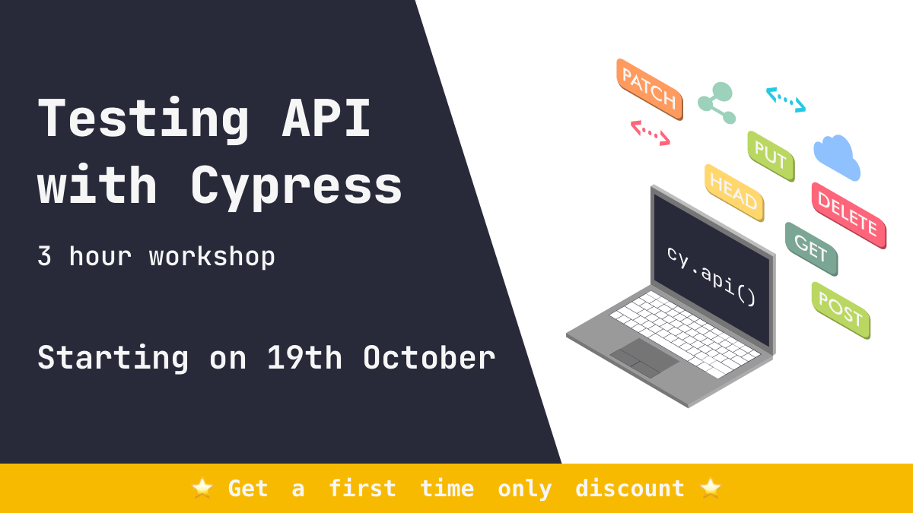

<h2 align=center>Cypress plugin API</h2>
<p align="center">
<a href="https://github.com/sponsors/filiphric"></a>
<a href="https://dashboard.cypress.io/projects/v2x96h/runs"></a>
</p>

<p align="center">
Cypress plugin for effective API testing. Imagine Postman, but in Cypress.
</p>


### Installation

Install this package:
```bash
npm i cypress-plugin-api

// or

yarn add cypress-plugin-api
```

Import the plugin into your `cypress/support/e2e.js` file:
```js
import 'cypress-plugin-api'
// or
require('cypress-plugin-api')
```

### Usage
You can now use `cy.api()` command. This command works exactly like `cy.request()` but in addition to calling your API, it will print our information about the API call in your Cypress runner.

### Features
- view responses in UI frame as well as in the timeline
- showing query objects, headers, request body and response
- color coding of methods
- copy response to clipboard (works for last test only)
- snapshots


### Issues
All the issues can be found on [issues page](https://github.com/filiphric/cypress-plugin-api/issues), feel free to open any new ones or contribute with your own code.

<!-- ### Want to learn more?
Come to my upcoming "Testing API with Cypress" workshop. We’ll be using this plugin and learning different ways of testing API.

[Register here](https://filiphric.com/cypress-api-testing-workshop)

 -->
<hr>
<p align="center">
...powered by coffee and love ❤️  <a href="https://filiphric.com">Filip Hric
</p>